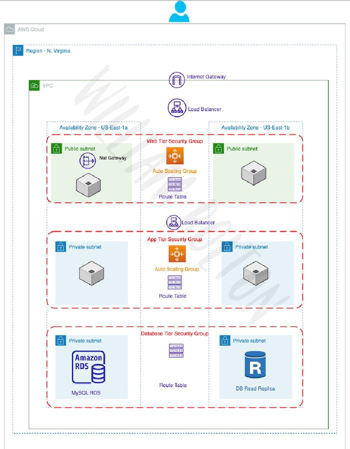
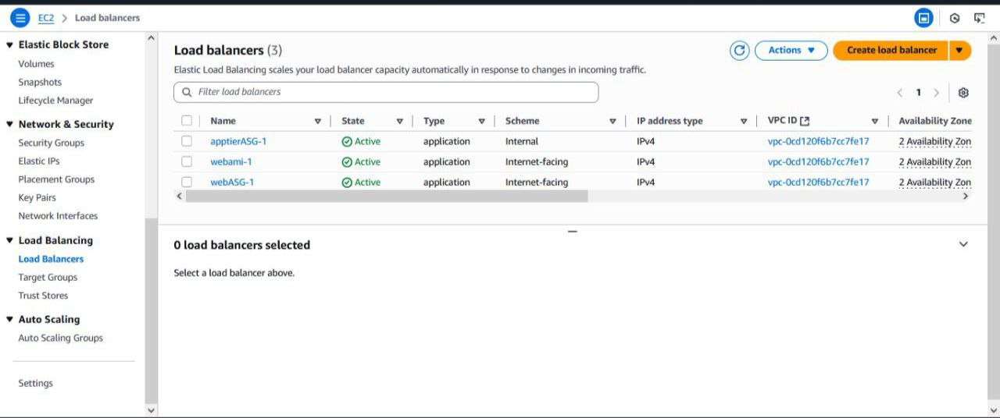
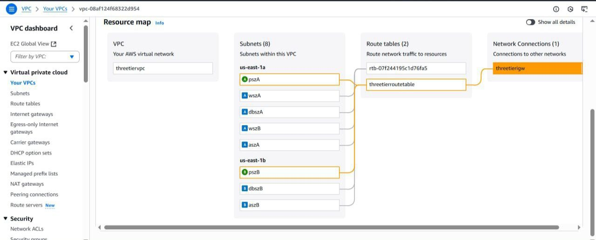
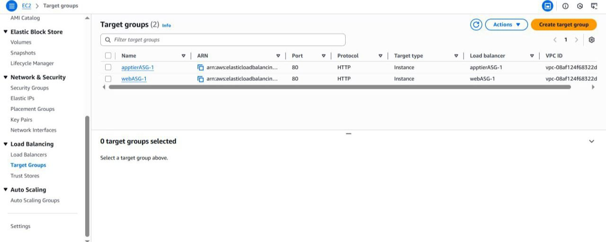
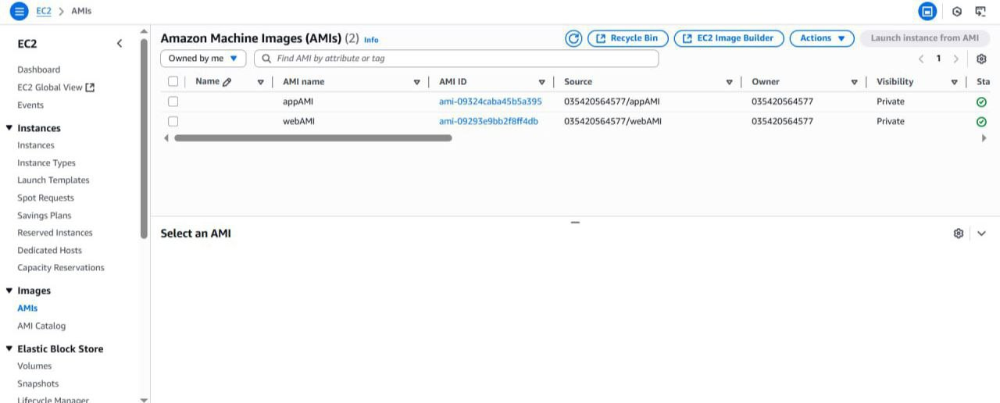
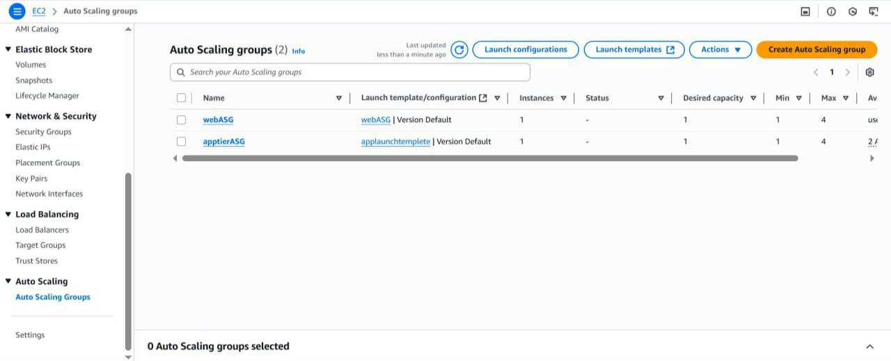
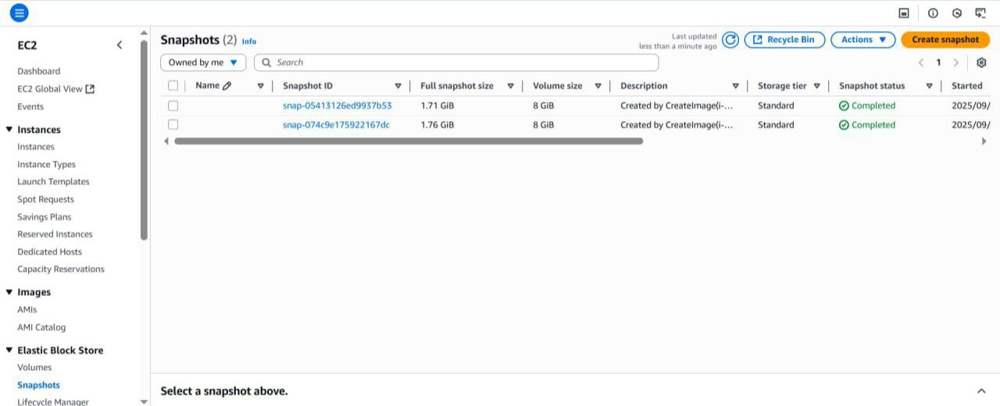

# Three-tier Architecture on AWS

## Introduction

This project leverages AWS to build a three-tier web application with distinct layers for the web interface, business logic, and database, ensuring enhanced security and scalability.

## Architecture Overview

#### The three-tier architecture divides responsibilities across distinct layers:

* **Web Tier:** Handles HTTP requests, serves static content, and forwards dynamic requests to the application tier.

* **Application Tier:** Executes business logic and communicates with the database tier.

* **Database Tier:** Handles data storage and retrieval, typically using a MySQL database.

## Infrastructure Components

### Networking setup

#### The core of our architecture is a custom VPC, structured with properly segmented public and private subnets for better isolation and security.

.png)

.png)

.png)

.png)

##  Web Tier Components

The Web Tier consists of:

* An **Auto Scaling** group of EC2 instances running web servers.

* An **internet-facing Application Load Balancer** that distributes incoming traffic.

* A **custom AMI** to ensure consistent and repeatable deployments across all instances.

### Application Tier 

#### Application Tier consists of:

The Application Tier consists of:

* An **Auto Scaling group** of EC2 instances running application servers.

* An **internal Application Load Balancer** to distribute requests from the Web Tier.

* A **custom AMI** to ensure consistent and reliable deployment of application code.

### Database Tier

#### Database Tier consists of:
* A **managed relational database instance** provisioned using Amazon RDS (e.g., MySQL), which simplifies database administration tasks such as patching and provisioning.

* **Multi-AZ deployment** enabled to provide high availability, fault tolerance, and automatic failover in the event of infrastructure issues.

* **Automated backups**, manual snapshots, and performance monitoring configured to ensure data durability, quick recovery, and operational visibility.

.png)

## Content Delivery and Storage

### For performance and scalability, we implemented:
* Amazon **CloudFront distribution** to accelerate content delivery by caching it at edge locations globally.

* An Application **Load Balancer** to evenly distribute traffic across multiple web servers handling both static and dynamic content.

## Implementation Steps

#### 1. Network Infrastructure

* Create a custom **VPC** (e.g., mycustomvpc) with a CIDR block such as 10.0.0.0/16.

* Configure **public and private subnets** across multiple Availability Zones to ensure high availability.

* Set up **route tables** to control traffic flow between subnets.

* Deploy a **NAT Gateway** in a public subnet to allow outbound internet access for resources in private subnets (e.g., application servers or database patching).

#### 2. Database Tier

* Launch an **Amazon RDS MySQL** instance within private subnets.

* Configure **security groups** to allow access only from the Application Tier.

* Ensure the database instance is **not publicly accessible;** access is limited to the Application Tier only.

* Store and manage **database connection details** securely within the application for safe communication.

#### 3. Application Tier

* Create a **custom AMI** containing the application code and runtime environment.

* Use a **Launch Template** to ensure consistent configuration of EC2 instances.

* Deploy an **internal Application Load Balancer (ALB)** to route requests from the Web Tier to application servers.

* Configure **Auto Scaling** to automatically adjust the number of instances based on traffic and resource utilization.

#### 4. Web Tier

* Create a **custom AMI** configured with a web server (e.g., Apache, NGINX).

* Use a **Launch Template** to deploy EC2 instances running the web server.

* Set up an **internet-facing Application Load Balancer (ALB)** to distribute incoming user traffic across web instances.

* Enable **Auto Scaling** to handle changes in user demand efficiently.

## Security Considerations

* **Database instances** reside in private subnets with no direct public access.

* The **Application Tier** is accessible only through the internal load balancer.

* The **Web Tier** is exposed to the internet but is protected by **security groups** and the **external ALB.**

* **Security groups** are configured to allow communication **only between intended tiers.**

* The **NAT Gateway** securely handles outbound internet traffic from private subnets.

## Performance Features

* **Auto Scaling** ensures that infrastructure scales dynamically with traffic demands.

* **Load Balancers** evenly distribute incoming requests, preventing server overload.

* **Multi-AZ deployment** for the database provides **high availability** and **automatic failover** in case of failure.

## Usage Flow

* Users send **HTTP/HTTPS requests** to the **Web Tier ALB.**

* The **Web Tier** serves static content and forwards dynamic requests to the **Application Tier** via the **internal ALB**.

* The **Application Tier** handles business logic and interacts with the **Database Tier** to read/write data.

* The **Database Tier** manages secure and persistent data storage.

## Monitoring

* Use **Amazon CloudWatch** to monitor EC2 instances, load balancers, and RDS performance metrics.

* Enable **logging and alarms** to maintain operational visibility and quickly identify and troubleshoot issues.

## Conclusion

* This classic **three-tier architecture** on AWS, enhanced with load balancers, delivers a **scalable, secure,** and **highly available** infrastructure without relying on Amazon S3 for storage. It follows **AWS best practices** by isolating each tier, using load balancers for efficient traffic distribution, and securing every layer through private networking and tightly scoped security groups.
